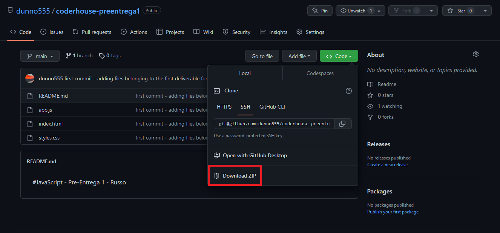

# JavaScript - Pre-Entrega 2 - Russo

### ¿Cómo acceder al programa?

1. Clonar el repositorio desde una terminal: `git clone git@github.com:dunno555/coderhouse-preentrega2-russo.git`
o descargarlo haciendo click en el botón "Code" y luego "Download ZIP" como lo muestra la imagen 
2. Una vez clonado o descargado, abrir un editor de código y abrir la carpeta **coderhouse-preentrega2-russo**
3. Levantar un server (en mi caso, estuve usando la extensión de VS Code llamada **Live Server**) desde el archivo `index.html`
4. Enjoy! :smiley: